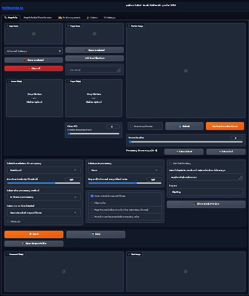

# Preview



## Hướng dẫn cài đặt

### Chuẩn bị

1. Mở PowerShell với quyền quản trị bằng cách nhấn phải vào biểu tượng PowerShell và chọn "Run as Administrator".

2. Chạy lệnh sau để cài đặt Chocolatey `nếu chưa có`:

    ```powershell
    Set-ExecutionPolicy Bypass -Scope Process -Force; [System.Net.ServicePointManager]::SecurityProtocol = [System.Net.ServicePointManager]::SecurityProtocol -bor 3072; iex ((New-Object System.Net.WebClient).DownloadString('https://community.chocolatey.org/install.ps1'))
    ```

3. Sau khi cài đặt Chocolatey thành công, chạy lệnh sau để cài đặt [Visual C++ Build Tools](https://visualstudio.microsoft.com/visual-cpp-build-tools/) và [Python](https://www.python.org/ftp/python/3.10.11/python-3.10.11-amd64.exe) kèm theo [Git](https://github.com/git-for-windows/git/releases/download/v2.43.0.windows.1/Git-2.43.0-64-bit.exe), [FFMPEG](https://github.com/BtbN/FFmpeg-Builds/releases):

    ```powershell
    choco install visualcpp-build-tools -y
    choco install python --version 3.10.11 -y
    choco install ffmpeg -y
    choco install git -y
    ```

### Chạy ứng dụng

Để chạy ứng dụng, hãy mở tệp `start.bat`

**Chú ý:** Lần đầu tiên cài đặt, bạn sẽ cần phải tải và cài đặt một số thư viện và các file phụ trợ có dung lượng khoảng `2. GB`.
